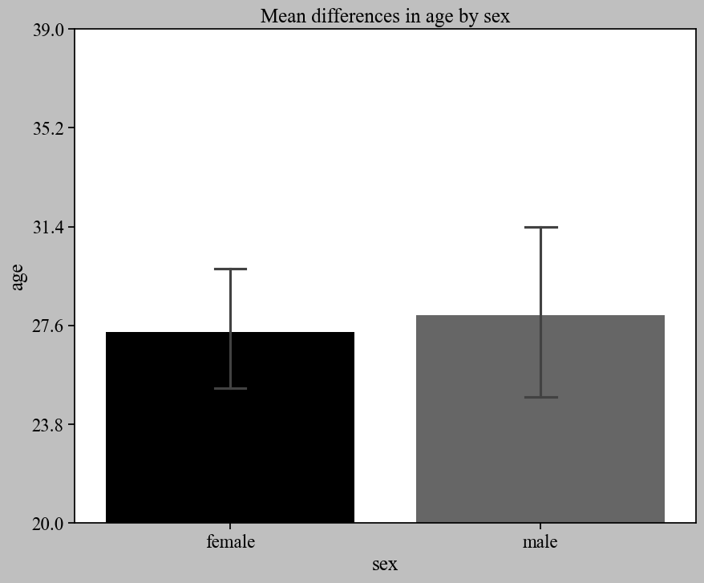
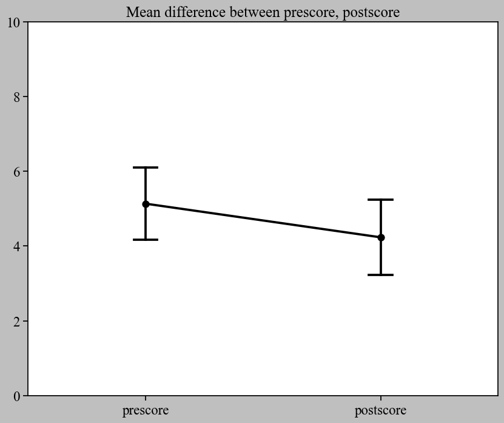
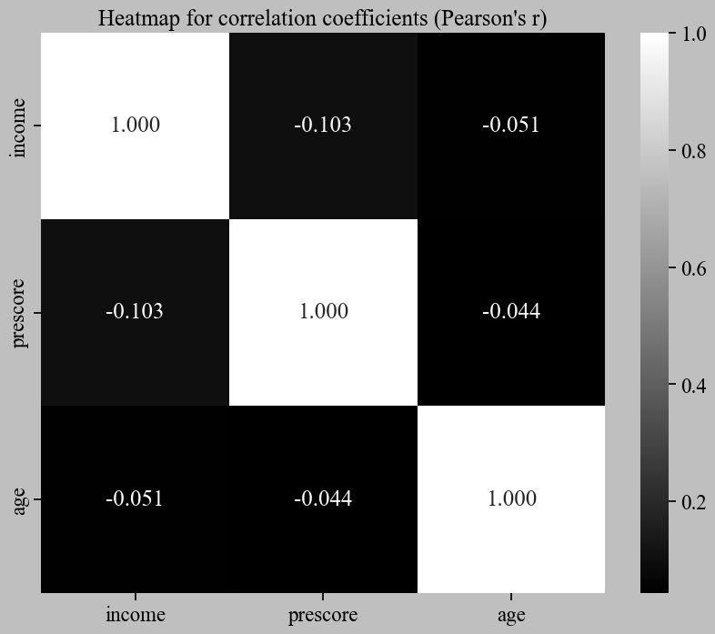
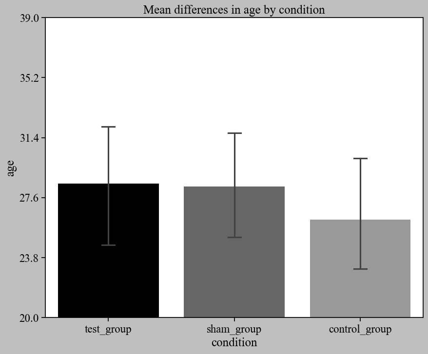
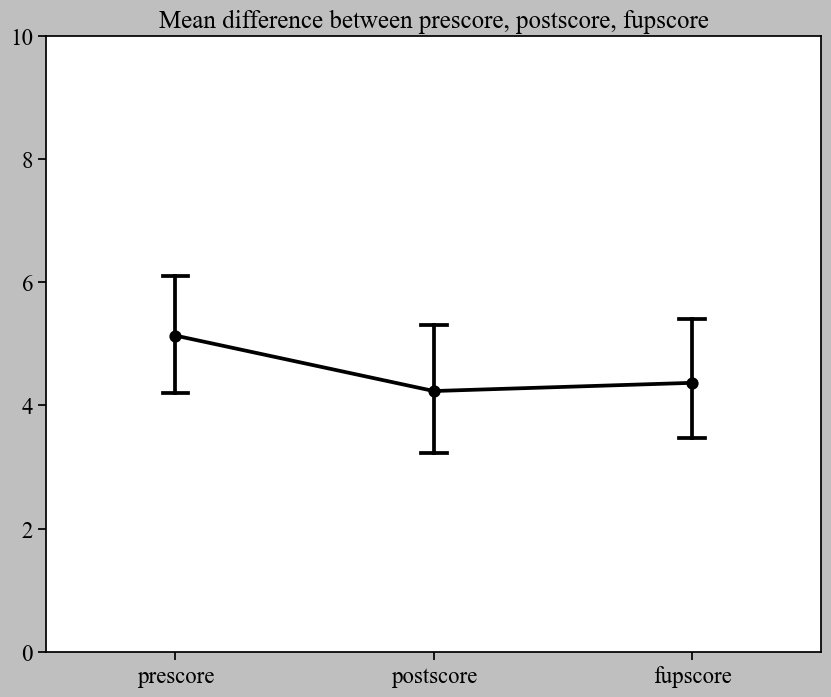

 
[](https://badge.fury.io/py/statmanager-kr)
[](https://github.com/ckdckd145/statmanager-kr/blob/main/LICENSE)


# Statmanager-kr
### Open-source statistical package for Python based on the Pandas.    
### Python과 Pandas 사용자를 위한 오픈소스 통계 패키지
 
#

Especially for researchers, data scientists, psychologist, students, and anyone who interested in conducting hypothesis testing. The statmanager-kr aims to organize packages that are "convenient to use", "uncompliated to use", and "convenient to see results". The end goal of statmanager-kr is to be a <b>simple and useful package</b> that <b>can be used </b>by people <b>who don't know much about Python and Pandas</b>.  

Pandas를 사용하며, 가설 검증에 대해 관심을 갖는 연구원, 데이터분석가, 심리학자, 학생 등을 위합니다. statmanager-kr은 사용하기 쉽고, 사용이 복잡하지 않으며, 결과를 확인하기에 편리한 패키지 구성을 목표로 개발됩니다. statmanager-kr 개발의 최종 목표는 <b>Python과 Pandas를 잘 알지 못하는 사람</b>도 이용할 수 있는 <b>매우 간편하면서도 유용한 패키지를 만드는 것</b>입니다.  

Currently, <b><u>KOREAN</u></b> and <b><u>ENGLISH</u></b> are supported.   
현재 지원하는 언어 세팅은 <b><u>한글</u></b>과 <b><u>영어</u></b>입니다. 


## Documentaion
[한글 공식 문서](https://cslee145.notion.site/cslee145/fd776d4f9a4f4c9db2cf1bbe60726971?v=3b2b237555fc4cd3a41a8da337d80c01)   
[Official Documentation](https://cslee145.notion.site/60cbfcbc90614fe990e02ab8340630cc?v=4991650ae5ce4427a215d1043802f5c0&pvs=4)


## Notifications :
Source codes are available in the [Github respository](https://github.com/ckdckd145/statmanager-kr)  
소스코드는 [깃헙 레포지토리](https://github.com/ckdckd145/statmanager-kr)에서 확인할 수 있습니다.  

For updates, please see [the notice in the documentation]((https://www.notion.so/cslee145/NOTICEs-4bb2177eeb0f412a81b8dbd3215058e6)) or the [Github release](https://github.com/ckdckd145/statmanager-kr/releases).  
업데이트 내역은 정식 문서 내 [공지사항](https://www.notion.so/cslee145/NOTICEs-4bb2177eeb0f412a81b8dbd3215058e6) 혹은 [Github release](https://github.com/ckdckd145/statmanager-kr/releases)에서 확인하시기 바랍니다.    

Please use [Github Discussion](https://github.com/ckdckd145/statmanager-kr/discussions) to let me know if you have any questions, bugs you encounter, suggestions, etc. Of course, you can also email the developer directly.   
궁금하신 점, 발생하는 버그, 제안 사항 등 모든 것은 [Github Discussion](https://github.com/ckdckd145/statmanager-kr/discussions)을 활용해서 알려주시면 감사하겠습니다. 물론, 개발자에게 직접 이메일을 보내셔도 됩니다. 


#
* [Quick Start with sample jupyter notebook file](https://github.com/ckdckd145/statmanager-kr/blob/main/test.ipynb) 
* Available functions | 현재 사용 가능한 분석
  * [Read detailed instructions](https://www.notion.so/cslee145/Documentation-74a610c12881402d96dc5d1654f97433?pvs=4#be93db7f4159419fa73eb324d6567793)  | [상세 사용법 열람](https://www.notion.so/cslee145/dded43262f784c70a37fddb11ec7c9d1?pvs=4#ef9a4aacd8b34b96bd7a4abdea4f5170)
    1. Normality assumption | 정규성 가정
    2. Homoskedasticity assumption | 등분산성 가정
    3. Reliability | 신뢰도 확인
    4. Frequency analysis  | 빈도분석
    5. Correlation analysis | 상관분석
    6. Comparison (2) | 차이비교 (2)
    7. Comparison (3) | 차이비교 (3)
    8. Regression


* Available functions to make figure or graph | 그래프 혹은 그림 제작에 활용되는 기능
  * P-P plot 
  * Q-Q plot 
  * Histogram 
  * Histogram (cumulative)
  * Pointplot (within differences)
  * Boxplot (between group difference)

#### Dependency
* pandas
* statsmodels
* scipy
* numpy
* matplotlib
* seaborn
* XlsxWriter

#### Recommendation
Using "Jupyter Notebook" is <b>STRONGLY RECOMMENDED</b> (Of course, statmanager-kr works just as well in a Python environment)   
"주피터 노트북(Jupyter Notebook)" 사용을 <b>강력하게 권고</b>합니다. 물론, Python 환경에서도 statmanager-kr은 문제없이 작동합니다.  

#### Installing statmanager-kr
    pip install statmanager-kr

#### Updating statmanager-kr
    pip install statmanager-kr --upgrade


# Quick Start


### Import 

```Python
import pandas as pd
from statmanager import Stat_Manager

df = pd.read_csv('testdf.csv', index_col = 'name')
sm = Stat_Manager(df, language = 'eng')
```

### Independent Samples T-test

```python
sm.progress(method = 'ttest_ind', vars = 'age', group_vars = 'sex').figure()
```

<details markdown="1">
  <summary><b>Output (Click to See)</b></summary>

|  | female | male |
| --- | --- | --- |
| n | 15.00 | 15.00 |
| mean | 27.33 | 28.00 |
| median | 26.00 | 26.00 |
| sd | 4.88 | 6.94 |
| min | 21.00 | 20.00 |
| max | 39.00 | 39.00 |

| dependent variable | t-value | degree of freedom | p-value | 95% CI | Cohen'd |
| --- | --- | --- | --- | --- | --- |
| height | -0.304 | 28 | 0.763 | [-5.153,  3.820] | -0.111 |



</details>

### Dependent Samples T-test

```python
sm.progress(method = 'ttest_rel', vars = ['prescore', 'postscore']).figure()
```

<details markdown="1">
  <summary><b>Output (Click to See)</b></summary>

|  | prescore | postscore |
| --- | --- | --- |
| n | … | … |
| mean | 5.13 | 4.23 |
| median | 5.50 | 4.00 |
| sd | 2.85 | 2.91 |
| min | … | … |
| max | … | … |

| variables | t-value | degree of freedom | p-value | 95% CI | Cohen's d |
| --- | --- | --- | --- | --- | --- |
| ['prescore', 'postscore'] | 1.198 | 29 | 0.24 | [-0.636, 2.436] | 0.313 |



</details>

### Pearson's Correlation

```python
sm.progress(method = 'pearsonr', vars = ['income', 'prescore', 'age']).figure()
```

<details markdown="1">
  <summary><b>Output (Click to See)</b></summary>

|  | n | Pearson's r | p-value | 95%_confidence_interval |
| --- | --- | --- | --- | --- |
| income & prescore | 30 | -0.103 | 0.588 | [-0.447, 0.267] |
| income & age | 30 | -0.051 | 0.789 | [-0.404, 0.315] |
| prescore & age | 30 | -0.044 | 0.816 | [-0.398, 0.321] |

|  | income | prescore | age |
| --- | --- | --- | --- |
| income | 1.000 | -0.103 | -0.051 |
| prescore | -0.103 | 1.000 | -0.044 |
| age | -0.051 | -0.044 | 1.000 |



</details>

### One-way ANOVA with Post-hoc test

```python
sm.progress(method = 'f_oneway', vars = 'age', group_vars = 'condition', posthoc = True).figure()
```

<details markdown="1">
  <summary><b>Output (Click to See)</b></summary>

|  | test_group | sham_group | control_group |
| --- | --- | --- | --- |
| n | 10 | 10 | 10 |
| mean | 28.5 | 28.3 | 26.2 |
| median | 27 | 29 | 25.5 |
| sd | 6.57 | 5.56 | 5.88 |
| min | … | … | … |
| max | … | … | … |

|  | sum_sq | df | F | p-value | partial eta  squared |
| --- | --- | --- | --- | --- | --- |
| Intercept | 6864.4 | 1 | 189.469 | 0 | 0.872 |
| C(condition) | 32.467 | 2 | 0.448 | 0.644 | 0.004 |
| Residual | 978.2 | 27 | NaN | NaN | 0.124 |

|Test  Multiple Comparison ttest_ind FWER=0.05 method=bonf alphacSidak=0.02,  alphacBonf=0. | | | | | | 
| --- | --- | --- | --- | --- | --- |

| group1 | group2 | stat | pval | pval_corr | reject |
| --- | --- | --- | --- | --- | --- |
| control_group | sham_group | -0.8204 | 0.4227 | 1 | FALSE |
| control_group | test_group | -0.8246 | 0.4204 | 1 | FALSE |
| sham_group | test_group | -0.0735 | 0.9422 | 1 | FALSE |




</details>

### One-way Repeated Measure ANOVA with Post-hoc test

```python
sm.progress(method = 'f_oneway_rm', vars = ['prescore','postscore','fupscore'], posthoc = True).figure()
```

<details markdown="1">
  <summary><b>Output (Click to See)</b></summary>

|  | prescore | postscore | fupscore |
| --- | --- | --- | --- |
| n | 30.00 | 30.00 | 30.00 |
| mean | 5.13 | 4.23 | 4.37 |
| median | 5.50 | 4.00 | 4.00 |
| sd | 2.85 | 2.91 | 2.62 |
| min | … | … | … |
| max | … | … | … |

|  | F Value | Num DF | Den DF | p-value | partial etq  squared |
| --- | --- | --- | --- | --- | --- |
| variable | 1.079 | 2 | 58 | 0.347 | 0.02 |


|Test  Multiple Comparison ttest_ind FWER=0.05 method=bonf alphacSidak=0.02,  alphacBonf=0. | | | | | | 
| --- | --- | --- | --- | --- | --- |

| group1 | group2 | stat | pval | pval_corr | reject |
| --- | --- | --- | --- | --- | --- |
| fupscore | postscore | 0.1866 | 0.8526 | 1 | FALSE |
| fupscore | prescore | -1.0849 | 0.2824 | 0.8473 | FALSE |
| postscore | prescore | -1.2106 | 0.231 | 0.6929 | FALSE |




</details>


## Development: Changseok Lee

<a href="https://www.github.com/ckdckd145" target="_blanck">
  
<a href="https://www.linkedin.com/in/cslee0052" target="_blank">
    
</a>
</a>
<a href="mailto:ckdckd145@gmail.com" target="_blank">
    
</a>
</center>


#
### Copyright (C) 2023 Changseok Lee